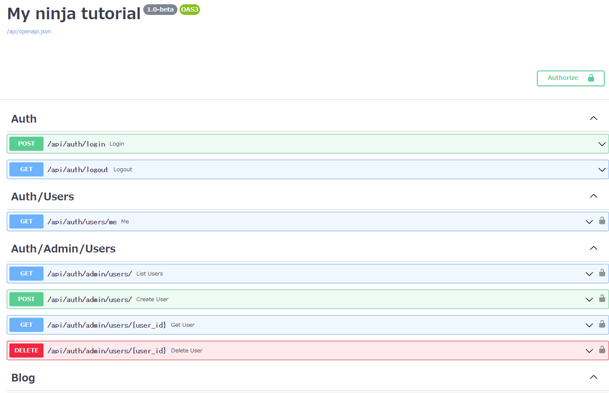

# django-ninja-tutorial

django-ninja is very cool framework for:

- Integrate Django (ORM, admin, etc)
- Schema based request validation, typing
- Auto generate OpenAPI document (`/docs`)

# Versions

- Python: 3.11.x
- Django: 4.2.x
- django-ninja: 1.0b2
- PyJWT: ^2.6.0

# Getting started

```shell
$ git clone https://github.com/skokado/django-ninja-tutorial.git
$ cd django-ninja-tutorial
$ python3 -m venv venv
$ source venv/bin/activate
$ poetry install
$ python manage.py migrate
$ python manage.py shell < scripts/seed_data/seed_users.py
$ python manage.py runserver 0.0.0.0:8000
```

then, you can see OpenAPI (Swagger) in http://localhost:8000/api/docs


